# 校园二手交易平台 业务流程测试

> 依据《测试计划.md》编写：测试目标 G2（主流程完整走通）与 G3（业务规则正确）、第八节执行顺序第 4 步（端到端流程串联）、第十节准出标准第 3 条（端到端流程与 3 条分支流程——取消、超时、重复提交拦截——全部通过）。
>
> 配套文档：[测试计划.md](../测试计划.md)、各模块《测试点梳理.xmind》《测试用例编写.xlsx》《缺陷记录表.xlsx》。

## 一、测试范围与通过标准

本节覆盖 7 条业务流程：1 条端到端主流程、3 条计划要求的分支流程、3 条支撑流程。每条流程都用浏览器按真实用户操作串起来跑，不单独验证某个页面，重点看**跨模块的状态流转、提示文案、数据一致性**。

| 判定项 | 通过标准 |
| --- | --- |
| 步骤正确性 | 每一步的提示文案、页面跳转、按钮可用状态与需求基线一致 |
| 状态流转 | 商品状态（在售/交易中/已售出/已下架）与订单状态（待卖家确认/交易中/已完成/已取消/超时关闭）一一对应 |
| 消息通知 | 六类业务动作对应的消息都能收到，标题与内容要点正确，未读红点同步 |
| 数据一致性 | 用测试计划第七节的 SQL 校验收藏数、未读数、订单与商品状态，结果无异常 |
| 分支覆盖 | 取消（4 种组合）、超时关闭、重复下单拦截三条分支全部通过 |
| 鉴权 | 未登录与登录态失效时都被拦截，且不产生业务数据 |

## 二、测试环境与数据准备

| 项目 | 内容 |
| --- | --- |
| 被测系统 | 校园二手交易平台 v1.0.0（Vue 3 + Spring Boot + MySQL 8），访问地址 http://localhost:8080 |
| 测试账号 | admin（管理员）、seller01（林晓）、seller02（陈默）、buyer01（苏晴），密码均为 123456；主流程另注册一个买家 buyer02 |
| 浏览器 | Microsoft Edge 或 Chrome（F12 查看请求，便于定位状态不一致的问题） |
| 数据准备 | 每轮开始先双击「重置数据.bat」（6 个分类 / 4 个账号 / 20 件商品 / 3 条收藏 / 2 笔订单 / 4 条消息） |
| 造数手段 | 超时场景用 SQL：`UPDATE trade_order SET expire_at = DATE_SUB(NOW(), INTERVAL 5 MINUTE) WHERE id = ? AND status = 'PENDING_CONFIRM';` |
| 账号切换顺序 | 按「买家 buyer01 → 卖家 seller01 → 管理员 admin」顺序执行，每步先退出登录再切账号，避免串号 |

## 三、业务流程清单

| 流程编号 | 流程名称 | 类型 | 参与角色 | 涉及需求 |
| --- | --- | --- | --- | --- |
| BP-01 | 主流程：注册 → 登录 → 发布 → 搜索 → 收藏 → 下单 → 卖家确认 → 买家完成 → 消息可见 | 主流程 | 访客、买家 buyer02（新注册）、卖家 seller01 | REQ-AUTH-01/02、REQ-PROD-01、3.4.1 搜索、REQ-FAV-01/05、REQ-ORDER-01/02/06/07、REQ-MSG-01/03/04 |
| BP-02 | 分支流程一：取消订单（待卖家确认 / 交易中，买卖双方均可取消） | 分支流程 | 买家 buyer01、卖家 seller01 | REQ-ORDER-08、REQ-ORDER-09、REQ-MSG（消息触发规则：取消订单）、商品状态规则 |
| BP-03 | 分支流程二：订单超时自动关闭（卖家未在确认时限内确认） | 分支流程 | 买家 buyer01、卖家 seller01、管理员 admin | REQ-ORDER-10、REQ-ADMIN-07、REQ-MSG（消息触发规则：订单超时关闭）、商品状态规则 |
| BP-04 | 分支流程三：重复下单拦截与商品锁定 | 分支流程 | 买家 buyer01、其他买家 seller02 | REQ-ORDER-02、REQ-ORDER-03、REQ-ORDER-04、REQ-LIST-02、REQ-DETAIL-04 |
| BP-05 | 支撑流程一：未登录与登录态失效时的鉴权跳转 | 支撑流程 | 访客、买家 buyer01 | REQ-AUTH-04、REQ-AUTH-05、REQ-AUTH-06、REQ-DETAIL-04、REQ-FAV-03 |
| BP-06 | 支撑流程二：商品上下架与状态限制 | 支撑流程 | 卖家 seller01、买家 buyer01 | REQ-PROD-05、REQ-PROD-06、REQ-PROD-04、商品状态规则 |
| BP-07 | 支撑流程三：管理端禁用与启用用户 | 支撑流程 | 管理员 admin、被操作账号 seller02 | REQ-ADMIN-01、REQ-ADMIN-04、REQ-ADMIN-05、REQ-AUTH-03 |

## 四、业务流程详解

### BP-01 主流程：注册 → 登录 → 发布 → 搜索 → 收藏 → 下单 → 卖家确认 → 买家完成 → 消息可见

- **类型**：主流程　**参与角色**：访客、买家 buyer02（新注册）、卖家 seller01
- **涉及需求**：REQ-AUTH-01/02、REQ-PROD-01、3.4.1 搜索、REQ-FAV-01/05、REQ-ORDER-01/02/06/07、REQ-MSG-01/03/04
- **关联用例**：TC-FE-001~009（注册登录）、TC-FE-030~044（发布）、TC-FE-010~029（搜索与详情）、TC-FE-045~053（订单）、TC-FE-054~058（消息）

**流程图**

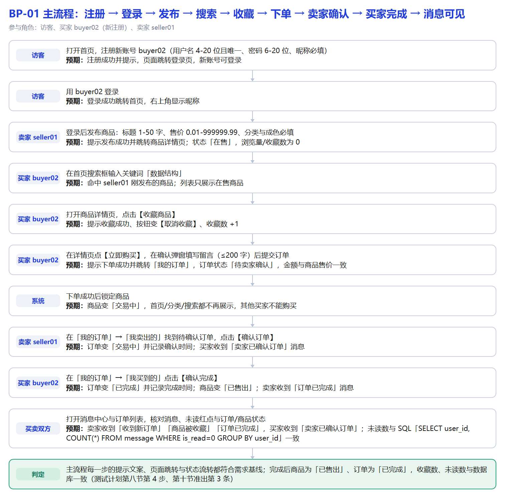

**流程步骤**

| 步骤 | 角色 | 操作 | 预期结果 |
| --- | --- | --- | --- |
| 1 | 访客 | 打开首页，注册新账号 buyer02（用户名 4-20 位且唯一、密码 6-20 位、昵称必填） | 注册成功并提示，页面跳转登录页，新账号可登录 |
| 2 | 访客 | 用 buyer02 登录 | 登录成功跳转首页，右上角显示昵称 |
| 3 | 卖家 seller01 | 登录后发布商品：标题 1-50 字、售价 0.01-999999.99、分类与成色必填 | 提示发布成功并跳转商品详情页；状态「在售」，浏览量/收藏数为 0 |
| 4 | 买家 buyer02 | 在首页搜索框输入关键词「数据结构」 | 命中 seller01 刚发布的商品；列表只展示在售商品 |
| 5 | 买家 buyer02 | 打开商品详情页，点击【收藏商品】 | 提示收藏成功、按钮变【取消收藏】、收藏数 +1 |
| 6 | 买家 buyer02 | 在详情页点【立即购买】，在确认弹窗填写留言（≤200 字）后提交订单 | 提示下单成功并跳转「我的订单」，订单状态「待卖家确认」，金额与商品售价一致 |
| 7 | 系统 | 下单成功后锁定商品 | 商品变「交易中」，首页/分类/搜索都不再展示，其他买家不能购买 |
| 8 | 卖家 seller01 | 在「我的订单」→「我卖出的」找到待确认订单，点击【确认订单】 | 订单变「交易中」并记录确认时间；买家收到「卖家已确认订单」消息 |
| 9 | 买家 buyer02 | 在「我的订单」→「我买到的」点击【确认完成】 | 订单变「已完成」并记录完成时间；商品变「已售出」；卖家收到「订单已完成」消息 |
| 10 | 买卖双方 | 打开消息中心与订单列表，核对消息、未读红点与订单/商品状态 | 卖家收到「收到新订单」「商品被收藏」「订单已完成」，买家收到「卖家已确认订单」；未读数与 SQL「SELECT user_id, COUNT(*) FROM message WHERE is_read=0 GROUP BY user_id」一致 |

**通过判定**：10 步全部通过；结束时订单为「已完成」、商品为「已售出」，买卖双方消息可见，未读数与 SQL 校验一致

**补充判定**：主流程每一步的提示文案、页面跳转与状态流转都符合需求基线；完成后商品为「已售出」、订单为「已完成」，收藏数、未读数与数据库一致（测试计划第八节第 4 步、第十节准出第 3 条）

### BP-02 分支流程一：取消订单（待卖家确认 / 交易中，买卖双方均可取消）

- **类型**：分支流程　**参与角色**：买家 buyer01、卖家 seller01
- **涉及需求**：REQ-ORDER-08、REQ-ORDER-09、REQ-MSG（消息触发规则：取消订单）、商品状态规则
- **关联用例**：订单管理 order_29~order_35（用例 order_29 买家取消待确认、order_30 卖家取消待确认、order_31 买家取消交易中、order_32 卖家取消交易中）

**流程图**

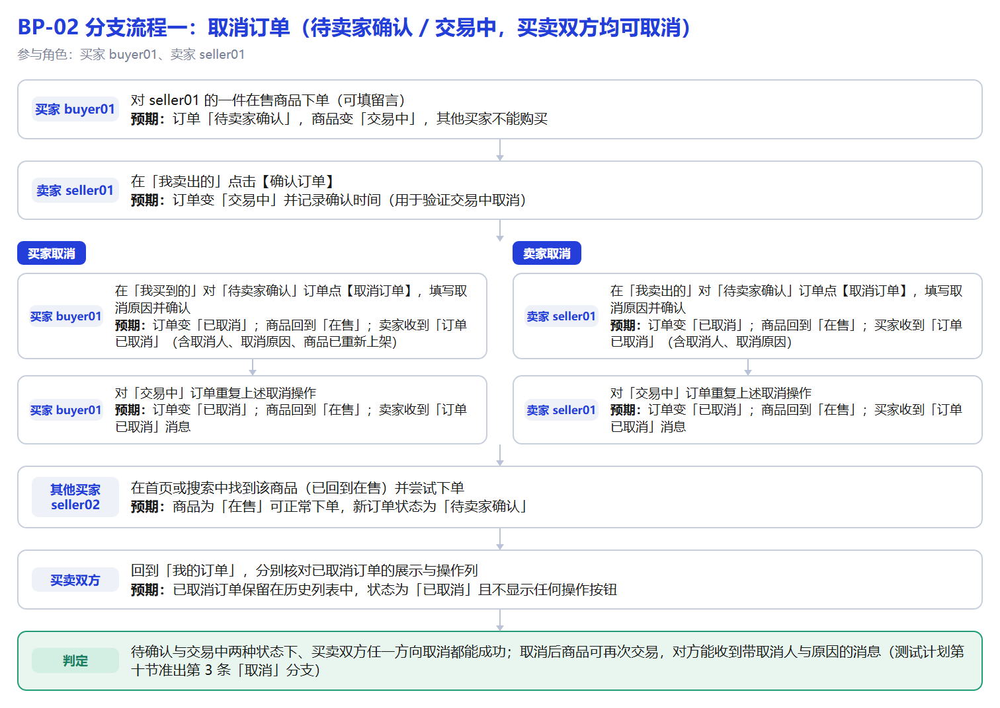

**流程步骤**

| 步骤 | 角色 | 操作 | 预期结果 |
| --- | --- | --- | --- |
| 1 | 买家 buyer01 | 对 seller01 的一件在售商品下单（可填留言） | 订单「待卖家确认」，商品变「交易中」，其他买家不能购买 |
| 2 | 卖家 seller01 | 在「我卖出的」点击【确认订单】 | 订单变「交易中」并记录确认时间（用于验证交易中取消） |
| 2.1 | 买家取消｜买家 buyer01 | 在「我买到的」对「待卖家确认」订单点【取消订单】，填写取消原因并确认 | 订单变「已取消」；商品回到「在售」；卖家收到「订单已取消」（含取消人、取消原因、商品已重新上架） |
| 2.2 | 买家取消｜买家 buyer01 | 对「交易中」订单重复上述取消操作 | 订单变「已取消」；商品回到「在售」；卖家收到「订单已取消」消息 |
| 2.3 | 卖家取消｜卖家 seller01 | 在「我卖出的」对「待卖家确认」订单点【取消订单】，填写取消原因并确认 | 订单变「已取消」；商品回到「在售」；买家收到「订单已取消」（含取消人、取消原因） |
| 2.4 | 卖家取消｜卖家 seller01 | 对「交易中」订单重复上述取消操作 | 订单变「已取消」；商品回到「在售」；买家收到「订单已取消」消息 |
| 3 | 其他买家 seller02 | 在首页或搜索中找到该商品（已回到在售）并尝试下单 | 商品为「在售」可正常下单，新订单状态为「待卖家确认」 |
| 4 | 买卖双方 | 回到「我的订单」，分别核对已取消订单的展示与操作列 | 已取消订单保留在历史列表中，状态为「已取消」且不显示任何操作按钮 |

**通过判定**：4 种取消组合全部通过：订单变「已取消」、商品回到「在售」、对方收到带取消人与原因的消息

**补充判定**：待确认与交易中两种状态下、买卖双方任一方向取消都能成功；取消后商品可再次交易，对方能收到带取消人与原因的消息（测试计划第十节准出第 3 条「取消」分支）

### BP-03 分支流程二：订单超时自动关闭（卖家未在确认时限内确认）

- **类型**：分支流程　**参与角色**：买家 buyer01、卖家 seller01、管理员 admin
- **涉及需求**：REQ-ORDER-10、REQ-ADMIN-07、REQ-MSG（消息触发规则：订单超时关闭）、商品状态规则
- **关联用例**：订单管理 order_39~order_42；测试计划第七节的造数 SQL（改写 trade_order.expire_at）

**流程图**

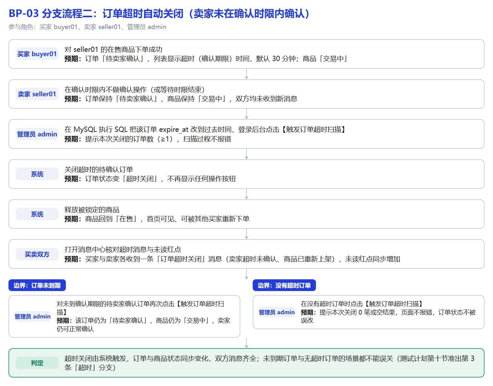

**流程步骤**

| 步骤 | 角色 | 操作 | 预期结果 |
| --- | --- | --- | --- |
| 1 | 买家 buyer01 | 对 seller01 的在售商品下单成功 | 订单「待卖家确认」，列表显示超时（确认期限）时间，默认 30 分钟；商品「交易中」 |
| 2 | 卖家 seller01 | 在确认时限内不做确认操作（或等待时限结束） | 订单保持「待卖家确认」，商品保持「交易中」，双方均未收到新消息 |
| 3 | 管理员 admin | 在 MySQL 执行 SQL 把该订单 expire_at 改到过去时间，登录后台点击【触发订单超时扫描】 | 提示本次关闭的订单数（≥1），扫描过程不报错 |
| 4 | 系统 | 关闭超时的待确认订单 | 订单状态变「超时关闭」，不再显示任何操作按钮 |
| 5 | 系统 | 释放被锁定的商品 | 商品回到「在售」，首页可见、可被其他买家重新下单 |
| 6 | 买卖双方 | 打开消息中心核对超时消息与未读红点 | 买家与卖家各收到一条「订单超时关闭」消息（卖家超时未确认、商品已重新上架），未读红点同步增加 |
| 6.1 | 边界：订单未到期｜管理员 admin | 对未到确认期限的待卖家确认订单再次点击【触发订单超时扫描】 | 该订单仍为「待卖家确认」，商品仍为「交易中」，卖家仍可正常确认 |
| 6.2 | 边界：没有超时订单｜管理员 admin | 在没有超时订单时点击【触发订单超时扫描】 | 提示本次关闭 0 笔或空结果，页面不报错，订单状态不被误改 |

**通过判定**：订单变「超时关闭」、商品回到「在售」、买卖双方都收到消息；未到期订单不被误关闭

**补充判定**：超时关闭由系统触发，订单与商品状态同步变化，双方消息齐全；未到期订单与无超时订单的场景都不能误关（测试计划第十节准出第 3 条「超时」分支）

### BP-04 分支流程三：重复下单拦截与商品锁定

- **类型**：分支流程　**参与角色**：买家 buyer01、其他买家 seller02
- **涉及需求**：REQ-ORDER-02、REQ-ORDER-03、REQ-ORDER-04、REQ-LIST-02、REQ-DETAIL-04
- **关联用例**：订单管理 order_09~order_14（order_11 其他账号不可购买、order_12 重复下单拦截、order_13 连点提交、order_14 不能购买自己的商品）

**流程图**

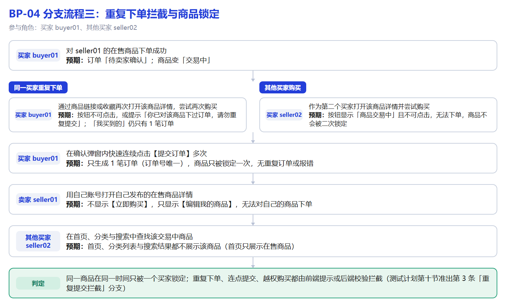

**流程步骤**

| 步骤 | 角色 | 操作 | 预期结果 |
| --- | --- | --- | --- |
| 1 | 买家 buyer01 | 对 seller01 的在售商品下单成功 | 订单「待卖家确认」；商品变「交易中」 |
| 1.1 | 同一买家重复下单｜买家 buyer01 | 通过商品链接或收藏再次打开该商品详情，尝试再次购买 | 按钮不可点击，或提示「你已对该商品下过订单，请勿重复提交」；「我买到的」仍只有 1 笔订单 |
| 1.2 | 其他买家购买｜买家 seller02 | 作为第二个买家打开该商品详情并尝试购买 | 按钮显示「商品交易中」且不可点击，无法下单，商品不会被二次锁定 |
| 2 | 买家 buyer01 | 在确认弹窗内快速连续点击【提交订单】多次 | 只生成 1 笔订单（订单号唯一），商品只被锁定一次，无重复订单或报错 |
| 3 | 卖家 seller01 | 用自己账号打开自己发布的在售商品详情 | 不显示【立即购买】，只显示【编辑我的商品】，无法对自己的商品下单 |
| 4 | 其他买家 seller02 | 在首页、分类与搜索中查找该交易中商品 | 首页、分类列表与搜索结果都不展示该商品（首页只展示在售商品） |

**通过判定**：同一买家不产生重复订单；其他买家无法购买交易中商品；连点提交只生成 1 笔；自己不能购买自己的商品

**补充判定**：同一商品在同一时间只被一个买家锁定；重复下单、连点提交、越权购买都由前端提示或后端校验拦截（测试计划第十节准出第 3 条「重复提交拦截」分支）

### BP-05 支撑流程一：未登录与登录态失效时的鉴权跳转

- **类型**：支撑流程　**参与角色**：访客、买家 buyer01
- **涉及需求**：REQ-AUTH-04、REQ-AUTH-05、REQ-AUTH-06、REQ-DETAIL-04、REQ-FAV-03
- **关联用例**：TC-FE-001~009（注册登录）；商品详情 pdd_06（未登录点击购买）

**流程图**

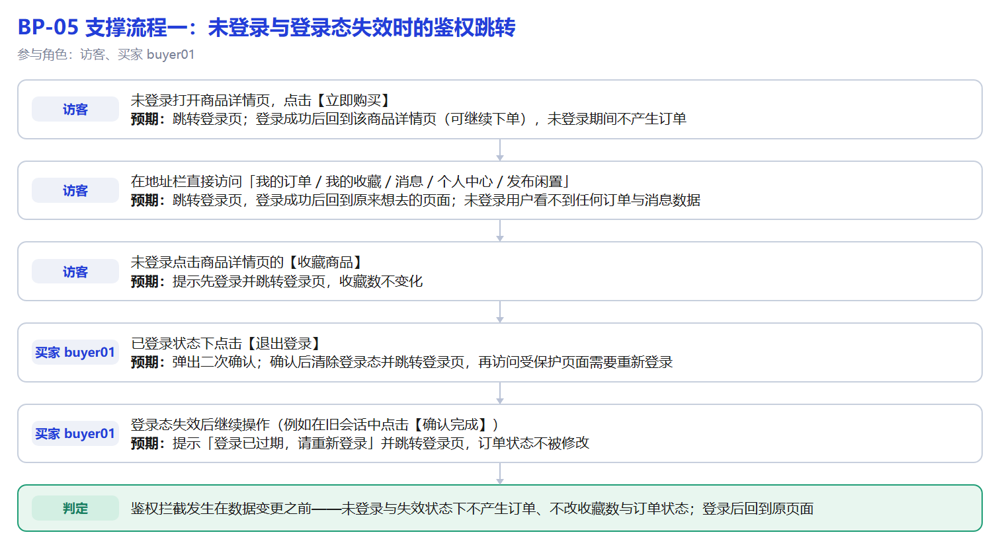

**流程步骤**

| 步骤 | 角色 | 操作 | 预期结果 |
| --- | --- | --- | --- |
| 1 | 访客 | 未登录打开商品详情页，点击【立即购买】 | 跳转登录页；登录成功后回到该商品详情页（可继续下单），未登录期间不产生订单 |
| 2 | 访客 | 在地址栏直接访问「我的订单 / 我的收藏 / 消息 / 个人中心 / 发布闲置」 | 跳转登录页，登录成功后回到原来想去的页面；未登录用户看不到任何订单与消息数据 |
| 3 | 访客 | 未登录点击商品详情页的【收藏商品】 | 提示先登录并跳转登录页，收藏数不变化 |
| 4 | 买家 buyer01 | 已登录状态下点击【退出登录】 | 弹出二次确认；确认后清除登录态并跳转登录页，再访问受保护页面需要重新登录 |
| 5 | 买家 buyer01 | 登录态失效后继续操作（例如在旧会话中点击【确认完成】） | 提示「登录已过期，请重新登录」并跳转登录页，订单状态不被修改 |

**通过判定**：未登录/登录态失效时都被挡在受保护页面之外，登录成功后回到原来想去的页面，期间不产生业务数据

**补充判定**：鉴权拦截发生在数据变更之前——未登录与失效状态下不产生订单、不改收藏数与订单状态；登录后回到原页面

### BP-06 支撑流程二：商品上下架与状态限制

- **类型**：支撑流程　**参与角色**：卖家 seller01、买家 buyer01
- **涉及需求**：REQ-PROD-05、REQ-PROD-06、REQ-PROD-04、商品状态规则
- **关联用例**：TC-FE-030~044（商品发布与管理）；商品列表模块（只展示在售商品）

**流程图**

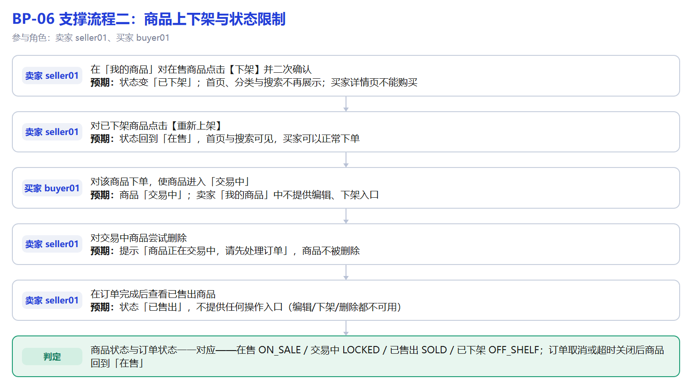

**流程步骤**

| 步骤 | 角色 | 操作 | 预期结果 |
| --- | --- | --- | --- |
| 1 | 卖家 seller01 | 在「我的商品」对在售商品点击【下架】并二次确认 | 状态变「已下架」；首页、分类与搜索不再展示；买家详情页不能购买 |
| 2 | 卖家 seller01 | 对已下架商品点击【重新上架】 | 状态回到「在售」，首页与搜索可见，买家可以正常下单 |
| 3 | 买家 buyer01 | 对该商品下单，使商品进入「交易中」 | 商品「交易中」；卖家「我的商品」中不提供编辑、下架入口 |
| 4 | 卖家 seller01 | 对交易中商品尝试删除 | 提示「商品正在交易中，请先处理订单」，商品不被删除 |
| 5 | 卖家 seller01 | 在订单完成后查看已售出商品 | 状态「已售出」，不提供任何操作入口（编辑/下架/删除都不可用） |

**通过判定**：在售↔已下架可正常切换，交易中/已售出商品的编辑、下架、删除都被限制，首页与搜索同步变化

**补充判定**：商品状态与订单状态一一对应——在售 ON_SALE / 交易中 LOCKED / 已售出 SOLD / 已下架 OFF_SHELF；订单取消或超时关闭后商品回到「在售」

### BP-07 支撑流程三：管理端禁用与启用用户

- **类型**：支撑流程　**参与角色**：管理员 admin、被操作账号 seller02
- **涉及需求**：REQ-ADMIN-01、REQ-ADMIN-04、REQ-ADMIN-05、REQ-AUTH-03
- **关联用例**：TC-FE-063~069（管理端）；TC-FE-003 禁用账号限制

**流程图**

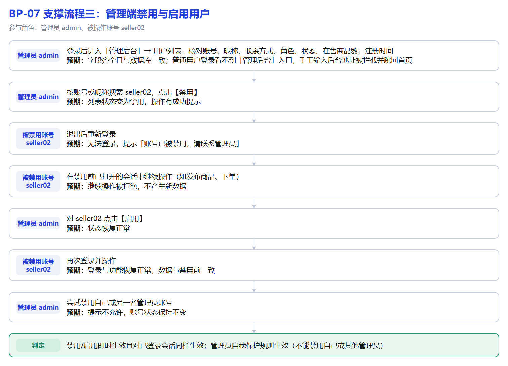

**流程步骤**

| 步骤 | 角色 | 操作 | 预期结果 |
| --- | --- | --- | --- |
| 1 | 管理员 admin | 登录后进入「管理后台」→ 用户列表，核对账号、昵称、联系方式、角色、状态、在售商品数、注册时间 | 字段齐全且与数据库一致；普通用户登录看不到「管理后台」入口，手工输入后台地址被拦截并跳回首页 |
| 2 | 管理员 admin | 按账号或昵称搜索 seller02，点击【禁用】 | 列表状态变为禁用，操作有成功提示 |
| 3 | 被禁用账号 seller02 | 退出后重新登录 | 无法登录，提示「账号已被禁用，请联系管理员」 |
| 4 | 被禁用账号 seller02 | 在禁用前已打开的会话中继续操作（如发布商品、下单） | 继续操作被拒绝，不产生新数据 |
| 5 | 管理员 admin | 对 seller02 点击【启用】 | 状态恢复正常 |
| 6 | 被禁用账号 seller02 | 再次登录并操作 | 登录与功能恢复正常，数据与禁用前一致 |
| 7 | 管理员 admin | 尝试禁用自己或另一名管理员账号 | 提示不允许，账号状态保持不变 |

**通过判定**：禁用后账号无法登录、已登录会话被拒绝；启用后恢复正常；管理员不能禁用自己或其他管理员

**补充判定**：禁用/启用即时生效且对已登录会话同样生效；管理员自我保护规则生效（不能禁用自己或其他管理员）

## 五、执行顺序与判定

| 顺序 | 步骤 | 执行方式 | 通过判定 |
| --- | --- | --- | --- |
| 1 | 页面冒烟：登录、首页浏览、商品详情、下一单、看消息红点 | 浏览器手工走一遍 | 5 步都正常，否则不进入下一步 |
| 2 | 执行 BP-01 主流程 | 4 个账号轮换登录，按流程步骤表逐步执行 | 每一步的提示与状态符合需求，商品最终为「已售出」 |
| 3 | 执行 BP-02 / BP-03 / BP-04 三条分支流程 | 每条分支重置数据后单独执行 | 取消 4 种组合、超时关闭、重复下单拦截全部通过 |
| 4 | 执行 BP-05 / BP-06 / BP-07 支撑流程 | 同上 | 鉴权、商品状态限制、管理端禁用启用全部符合预期 |
| 5 | 状态与数据一致性校验 | 执行测试计划第七节的 SQL | 收藏数、未读数、订单与商品状态全部一致 |
| 6 | 缺陷回归 | 修复后重跑对应流程 + BP-01 主流程 | 缺陷全部关闭，无新增问题 |

## 六、执行记录模板

| 流程编号 | 执行日期 | 执行人 | 结果 | 失败步骤 | 关联缺陷ID | 证据（截图路径） | 备注 |
| --- | --- | --- | --- | --- | --- | --- | --- |
| BP-01 |  |  | 通过 / 失败 |  |  | docs/测试执行证据/截图/ |  |
| BP-02 |  |  |  |  |  |  |  |
| BP-03 |  |  |  |  |  |  |  |
| BP-04 |  |  |  |  |  |  |  |
| BP-05 |  |  |  |  |  |  |  |
| BP-06 |  |  |  |  |  |  |  |
| BP-07 |  |  |  |  |  |  |  |

执行说明：每条流程执行前先「重置数据.bat」；失败步骤写成「步骤号 + 实际现象」，并在《缺陷记录表》中登记对应缺陷（缺陷标题、复现步骤、预期与实际）；修复后重跑该流程与 BP-01 主流程做回归。

## 附录：流程图源码（Mermaid）

正文中的流程图是图片（`流程图/` 目录），下面是同一套流程的 Mermaid 源码，粘贴到支持 Mermaid 的编辑器（Typora、VS Code、GitHub、语雀）即可重新渲染或修改。

### BP-01 主流程

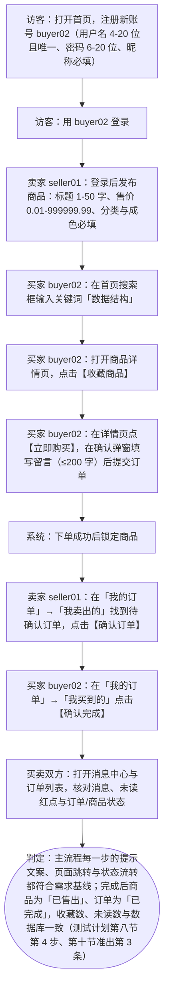

### BP-02 取消订单

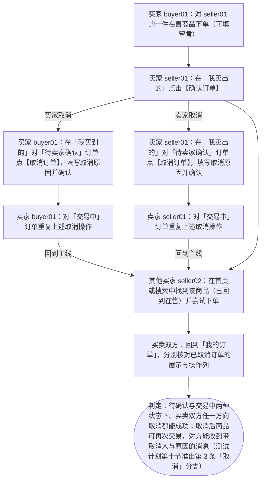

### BP-03 超时关闭

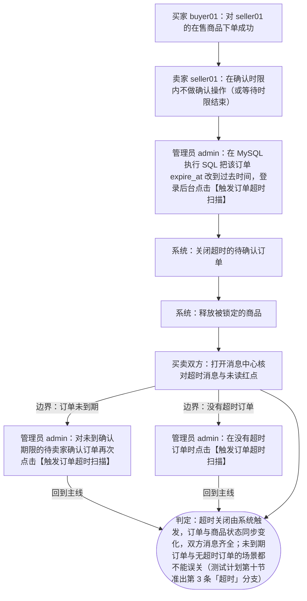

### BP-04 重复提交拦截

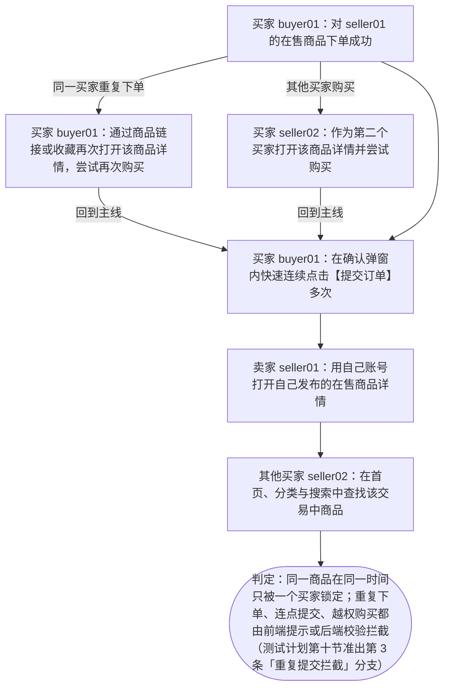

### BP-05 鉴权跳转

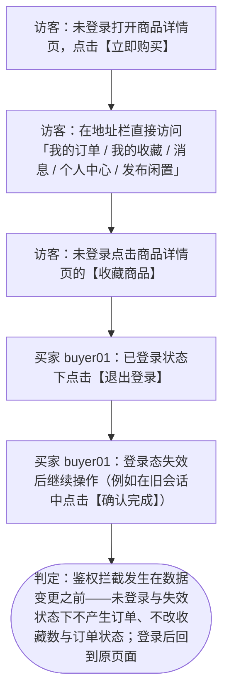

### BP-06 上下架状态流转

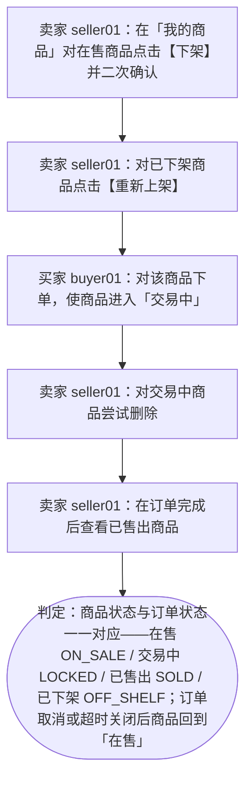

### BP-07 禁用启用用户

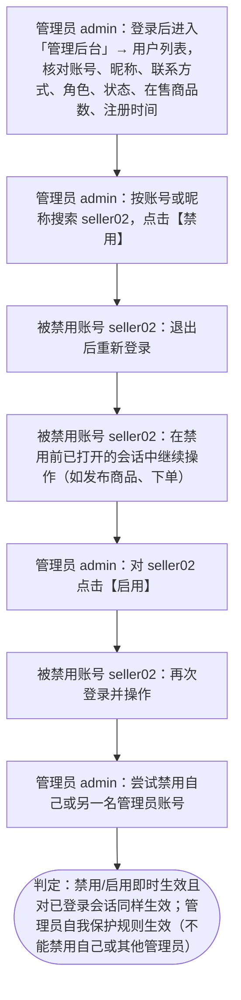
